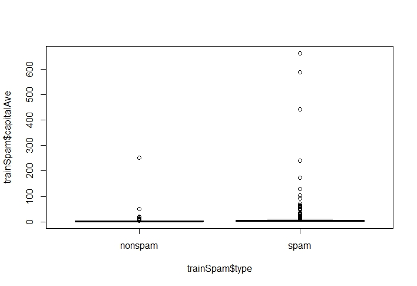
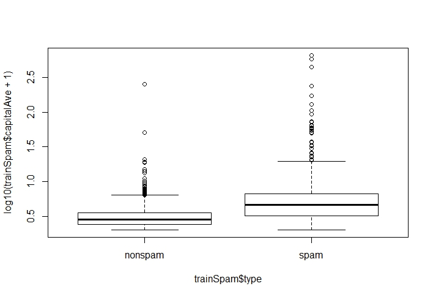
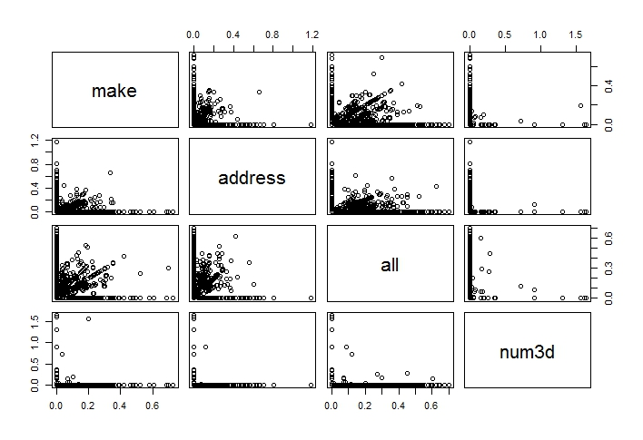
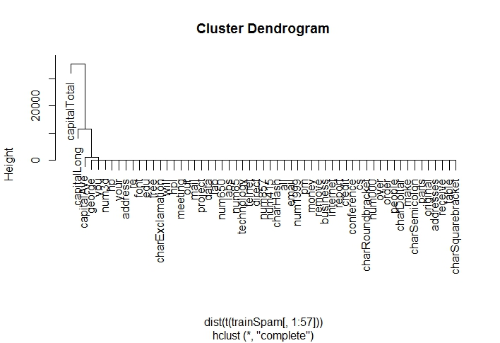
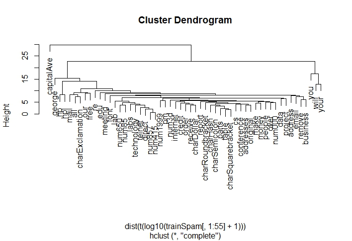

# Structure of a Data Analysis
## Steps in a data analysis
- Part 1
	- Define the question
	- Define the ideal data set
	- Determine what data you can access
	- Obtain the data
	- Clean the data
- Part 2
	- Exploratory data analysis
	- Statistical prediction/modeling
	- Interpret results
	- Challenge results
	- Synthesize/write up results
	- Create reproducible code

## The key challenge in data analysis
> Ask yourselves, what problem have you solved, ever, that was worth solving, where you knew all of the given information in advance? Where you didn't have a surplus of information and have to filter it out, or you had insufficient information and have to go find some? - [Dan Myer, Mathematics Educator](http://www.ted.com/talks/dan_meyer_math_curriculum_makeover)

## Defining a question

1. Statistical methods development
2. [Danger zone!!!](http://drewconway.com/zia/?p=2378)
3. Proper data analysis

## An example
###### Start with a general question
Can I automatically detect emails that are spam and that are not?
###### Make it concrete
Can I use quantitative characteristics of the emails to classify them as spam?

## Define the ideal dataset
- The dataset may depend on your goal
	- Descriptive - a whole population
	- Exploratory - a random sample with many variables measured
	- Inferential - the right population, randomly sampled
	- Predictive - a training and test dataset from the same population
	- Causal - data from a randomized study
	- Mechanistic - data about all components of the system

## Our example

[http://www.google.com/about/datacenters/inside/](http://www.google.com/about/datacenters/inside/)

## Determine what data you can access
- Sometimes you can find data free on the web
- Other times you may need to buy the data
- Be sure to respect the terms of use
- If the data don't exist, you may need to generate it yourself

## Back to our example


## A possible solution

[http://archive.ics.uci.edu/ml/datasets/Spambase](http://archive.ics.uci.edu/ml/datasets/Spambase)

## Obtain the data
- Try to obtain the raw data
- Be sure to reference the source
- Polite emails go a long way
- If you will load the data from an internet source, record the url and time accessed

## Our dataset - comes with the `kernlab` package in R

[http://search.r-project.org/library/kernlab/html/spam.html](http://search.r-project.org/library/kernlab/html/spam.html)

## Clean the data
- Raw data often needs to be processed
- If it is pre-processed, make sure you understand how
- Understand the source of the data (census, sample, convenience sample, etc.)
- May need reformatting, subsampling - record these steps
- **Determine if the data are good enough** - if not, quit or change the data

## Our cleaned dataset
``` r
library(kernlab)
data(spam)
str(spam[,1:5])
```
``` r
'data.frame':	4601 obs. of  5 variables:
 $ make   : num  0 0.21 0.06 0 0 0 0 0 0.15 0.06 ...
 $ address: num  0.64 0.28 0 0 0 0 0 0 0 0.12 ...
 $ all    : num  0.64 0.5 0.71 0 0 0 0 0 0.46 0.77 ...
 $ num3d  : num  0 0 0 0 0 0 0 0 0 0 ...
 $ our    : num  0.32 0.14 1.23 0.63 0.63 1.85 1.92 1.88 0.61 0.19 ...
```
[http://search.r-project.org/library/kernlab/html/spam.html](http://search.r-project.org/library/kernlab/html/spam.html)

## Subsampling our dataset
###### We need to generate a test and training set (prediction)
``` r 
library(kernlab)
data(spam)

# Perform the subsampling
set.seed(3435)
trainIndicator <- rbinom(4601, size=1, prob=0.5)
table(trainIndicator)
```
``` r
trainIndicator
   0    1 
2314 2287
```
``` r
trainSpam <- spam[trainIndicator==1,]
testSpam <- spam[trainIndicator==0,]
```

## Exploratory data analysis
- Look at summaries of the data
- Check for missing data
- Create exploratory plots
- Perform exploratory analyses (e.g. clustering)

## Names
``` r
names(trainSpam)
```
``` r
 [1] "make"              "address"           "all"              
 [4] "num3d"             "our"               "over"             
 [7] "remove"            "internet"          "order"            
[10] "mail"              "receive"           "will"             
[13] "people"            "report"            "addresses"        
[16] "free"              "business"          "email"            
[19] "you"               "credit"            "your"             
[22] "font"              "num000"            "money"            
[25] "hp"                "hpl"               "george"           
[28] "num650"            "lab"               "labs"             
[31] "telnet"            "num857"            "data"             
[34] "num415"            "num85"             "technology"       
[37] "num1999"           "parts"             "pm"               
[40] "direct"            "cs"                "meeting"          
[43] "original"          "project"           "re"               
[46] "edu"               "table"             "conference"       
[49] "charSemicolon"     "charRoundbracket"  "charSquarebracket"
[52] "charExclamation"   "charDollar"        "charHash"         
[55] "capitalAve"        "capitalLong"       "capitalTotal"     
[58] "type"    
```

## Head
``` r
head(trainSpam)
```
``` r
   make address  all num3d  our over remove internet order mail receive will
1  0.00    0.64 0.64     0 0.32 0.00   0.00        0  0.00 0.00    0.00 0.64
7  0.00    0.00 0.00     0 1.92 0.00   0.00        0  0.00 0.64    0.96 1.28
9  0.15    0.00 0.46     0 0.61 0.00   0.30        0  0.92 0.76    0.76 0.92
12 0.00    0.00 0.25     0 0.38 0.25   0.25        0  0.00 0.00    0.12 0.12
14 0.00    0.00 0.00     0 0.90 0.00   0.90        0  0.00 0.90    0.90 0.00
16 0.00    0.42 0.42     0 1.27 0.00   0.42        0  0.00 1.27    0.00 0.00
   people report addresses free business email  you credit your font num000 money
1    0.00      0         0 0.32        0  1.29 1.93   0.00 0.96    0      0  0.00
7    0.00      0         0 0.96        0  0.32 3.85   0.00 0.64    0      0  0.00
9    0.00      0         0 0.00        0  0.15 1.23   3.53 2.00    0      0  0.15
12   0.12      0         0 0.00        0  0.00 1.16   0.00 0.77    0      0  0.00
14   0.90      0         0 0.00        0  0.00 2.72   0.00 0.90    0      0  0.00
16   0.00      0         0 1.27        0  0.00 1.70   0.42 1.27    0      0  0.42
   hp hpl george num650 lab labs telnet num857 data num415 num85 technology
1   0   0      0      0   0    0      0      0 0.00      0     0          0
7   0   0      0      0   0    0      0      0 0.00      0     0          0
9   0   0      0      0   0    0      0      0 0.15      0     0          0
12  0   0      0      0   0    0      0      0 0.00      0     0          0
14  0   0      0      0   0    0      0      0 0.00      0     0          0
16  0   0      0      0   0    0      0      0 0.00      0     0          0
   num1999 parts pm direct cs meeting original project re edu table conference
1     0.00     0  0   0.00  0       0      0.0       0  0   0     0          0
7     0.00     0  0   0.00  0       0      0.0       0  0   0     0          0
9     0.00     0  0   0.00  0       0      0.3       0  0   0     0          0
12    0.00     0  0   0.00  0       0      0.0       0  0   0     0          0
14    0.00     0  0   0.00  0       0      0.0       0  0   0     0          0
16    1.27     0  0   0.42  0       0      0.0       0  0   0     0          0
   charSemicolon charRoundbracket charSquarebracket charExclamation charDollar
1          0.000            0.000                 0           0.778      0.000
7          0.000            0.054                 0           0.164      0.054
9          0.000            0.271                 0           0.181      0.203
12         0.022            0.044                 0           0.663      0.000
14         0.000            0.000                 0           0.000      0.000
16         0.000            0.063                 0           0.572      0.063
   charHash capitalAve capitalLong capitalTotal type
1     0.000      3.756          61          278 spam
7     0.000      1.671           4          112 spam
9     0.022      9.744         445         1257 spam
12    0.000      1.243          11          184 spam
14    0.000      2.083           7           25 spam
16    0.000      5.659          55          249 spam
```

## Summaries
``` r
table(trainSpam$type)
```
``` r
nonspam    spam 
   1381     906 
```

## Plots
``` r
plot(trainSpam$capitalAve ~ trainSpam$type)
```

``` r
plot(log10(trainSpam$capitalAve + 1) ~ trainSpam$type)
```


## Relationships between predictors
``` r
plot(log10(trainSpam[,1:4] + 1))
```


## Clustering
``` r
hCluster <- hclust(dist(t(trainSpam[,1:57])))
plot(hCluster)
```

## Attempting to adjust for skewness
``` r
hCluster <- hclust(dist(t(log10(trainSpam[,1:55] + 1))))
plot(hCluster)
```


## Statistical prediction/modeling
- Should be informed by the results of your exploratory analysis
- Exact methods depend on the question of interest
- Transformations/processing should be accounted for when necessary
- Measures of uncertainty should be reported

## Statistical prediction/modeling
``` r
trainSpam$numType <- as.numeric(trainSpam$type) - 1
costFunction <- function(x, y) sum(x != (y > 0.5))
cvError <- rep(NA, 55)
library(boot)
for (i in 1:55) {
    lmFormula <- reformulate(names(trainSpam)[i], response="numType")
    glmFit <- glm(lmFormula, family="binomial", data=trainSpam)
    cvError[i] <- cv.glm(trainSpam, glmFit, costFunction, 2)$delta[2]
}

# Which predictor has minim cross-validated error?
names(trainSpam)[which.min(cvError)]
```
``` r
[1] "charDollar"
```

## Get a measure of uncertainty
``` r
# use the best model from the group
predictionModel <- glm(numType ~ charDollar, family="binomial", data=trainSpam)
 
# Get predictions on the test data
predictionTest <- predict(predictionModel, testSpam)
predictedSpam <- rep("nonspam", dim(testSpam)[1])

## Classify as spam for those with prob > 0.5
predictedSpam[predictionModel$fitted > 0.5] = "spam"
```

## Get a measure of uncertainty
``` r
# Classification table
table(predictedSpam, testSpam$type)
```
``` r             
predictedSpam nonspam spam
      nonspam    1346  458
      spam         61  449
```
``` r 
# Error rate
(61 + 468) / (1346 + 458 + 61 + 449)
```
``` r
[1] 0.2286085
```

## Interpret results
- Use the appropriate language
	- describes
	- correlates with/associated with
	- leads to/causes
	- predicts
- Give an explanation
- Interpret coefficients
- Interpret measures of uncertainty

## our example
- The fraction of characters that are dollar signs can be used to predict if an email is Spam
- Anything with 6.6% dollar signs is classified as spam
- More dollar signs always mean more spam under our prediction
- Our test set error rate was 22.4%

## Challenge results
- Challenge all steps:
	- Question
	- Data source
	- Processing
	- Analyses
	- Conclusions
- Challenge measures of uncertainty
- Challenge choices of terms to include in models
- Think of potential alternative analyses

## Synthesize/write-up results
- Lead with the question
- Summarize the analyses into the story
- Don't include every analysis, include it
	- If it is needed for the story
	- If it is needed to address a challenge
- Order analyses according to the story, rather than chronologically
- Include "pretty" figures that contribute to the story

## In our example
- Lead with the question
	- Can I use quantitative characteristics of the emails to classify them as spam?
- Describe the approach
	- Collected data from UCI -> created training/test sets
	- Explored relationships
	- Choose logistic model on training set by cross validation
	- Applied to test, 78% test set accuracy
- Interpret results
	- Number of dollar signs seems reasonable, e.g. "Make money with Viagra $$$$!"
- Challenge results
	- 78% isn't that great
	- I could use more variables
	- Why logistic regression?

## Create reproducible code


