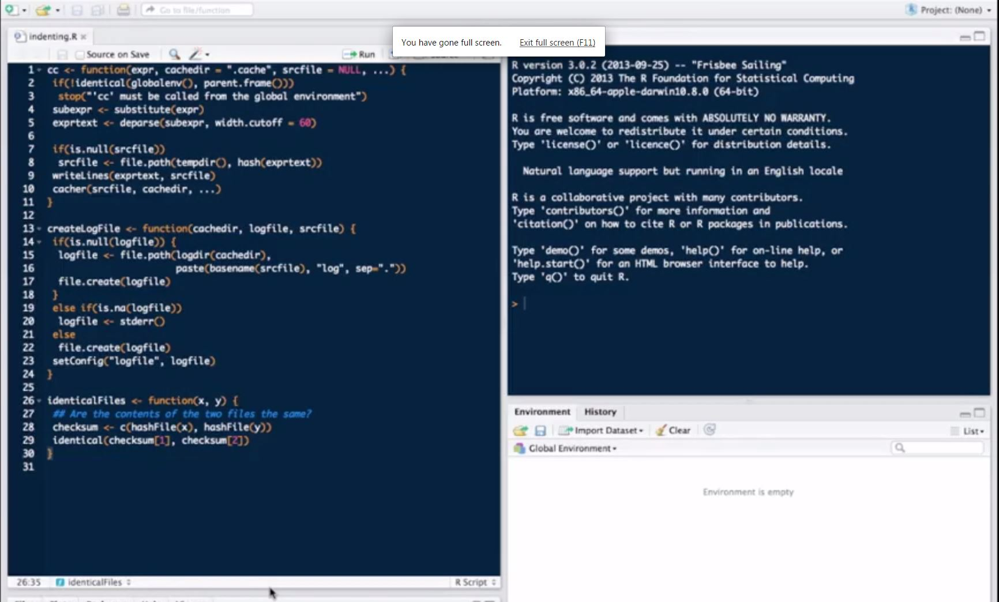

# Coding standards in R
## Introduction
- Help make your code readable and more usable by others
- Everyone has their own style
- But there are some minimal standards that are important

## Coding standards rules of thumbs
1. Always use text files / text editor
2. Indent your code
3. Limit the width of your code (80 columns?)
4. Limit the length of individual functions

## Bad code format example

## Indenting
- Indenting improves readability
- Fixing line length (80 columns) prevents lots of nesting and very long functions
- Suggested: Indents of 4 spaces at minimum; 8 spaces ideal