# Literate Statistical Programming with `knitr`
## Problems, Problems
- Authors must undertake considerable effort to put data/results on the web  
- Readers must download data/results individually and piece together which data go with which code sections, etc.
- Authors/readers must manually interact with websites
- There is no single document to integrate data analysis with textual representations; i.e. data, code, and text are not linked.

## Literate Statistical Programming
- Original idea comes from Don Knuth
- An article is a stream of **text** and **code**
- Analysis code is divided into text and code "chunks"
- Presentation code formats results (tables, figures, etc.)
- Article text explains what is going on
- Literate programs are **weaved** to produce human-readable documents and **tangled** to produce machine-readable documents.
- Literate programming is a general concept. We need
    - A documentation language
    - A programming language
- The original **Sweave** system developed by Friedrich Leisch used L<sup>A</sup>T<sub>E</sub>X and R
- **knitr** supports a variety of documentation languages

## How do I make my work reproducible?
- Decide to do it (ideally from the start)
- Keep track of things, perhaps with a version control system to track snapshots/changes
- Use software whose operation an be coded
- Don't save output (including raw data & preprocessing code)
- Save data in non-proprietary formats

## Literate Programming: Pros
- Text and code all in one place, logical order
- Data, results automatically updated to reflect external changes
- Code is live -- automatic "regression test" when building a document

## Literate Programming: Cons
- Text and code all in one place; can make documents difficult to read, especially if there is a **lot** of code
- Can substantially slow down processing of documents (although there are tools to help)

## What is `knitr`?
- An R package written by Yihui Xie (while he was a grad student at Iowa State)
    - Available on CRAN
- Supports RMarkdown, L<sup>A</up>T<sub>E</sub>X, and HTML as documentation languages
- Can export to PDF, HTML
- Built right into RStudio for your convenience

## Requirements
- A recent version of R
- A text editor (the one that comes with RStudio is okay)
- Some support packages also available on CRAN
- Some knowledge of Markdown, L<sup>A</sup>T<sub>E</sub>X, or HTML
- We will use Markdown here

## What is Markdown?
- A simplified version of "markup" languages
- No special editor required
- Simple, intuitive formatting elements
- Complete niformation available at [http://goo.gl/MUt9i5](http://goo.gl/MUt9i5)

## What is `knitr` good for?
- Manuals
- Short/medium-length technical documents
- Tutorials
- Reports (esp. if generated periodically)
- Data preprocessing documents/summaries

## What is `knitr` NOT good for?
- Very long research articles
- Complex time-consuming computations
- Documents that require precise formatting

## My First `knitr` Document
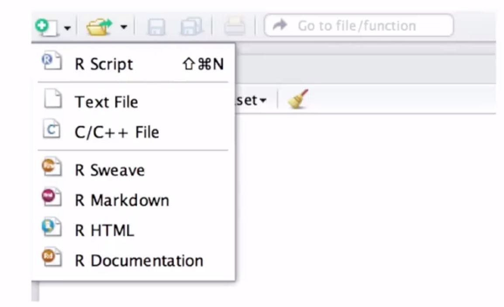
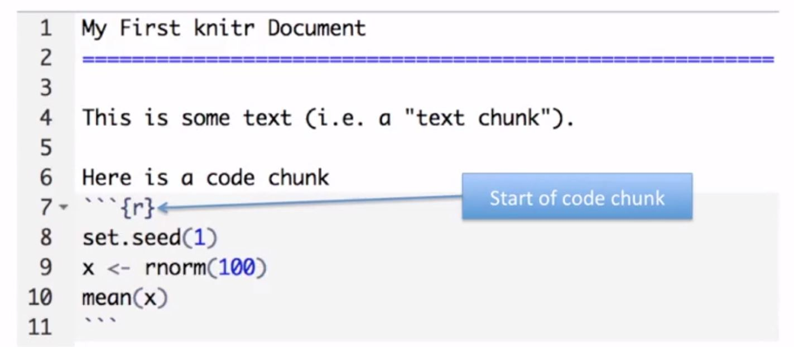

## Processing a `knitr` Document
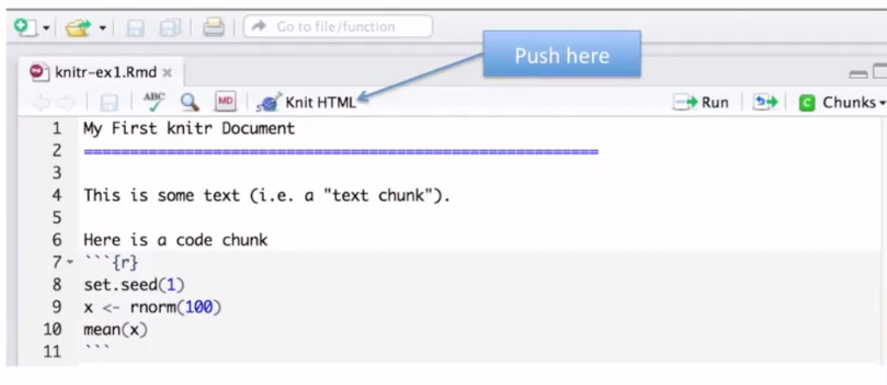

## More complicated way
library(knitr)
setwd(<working directory>)
knit2html("document.Rmd")
browseURL("document.html")

## HTML Output
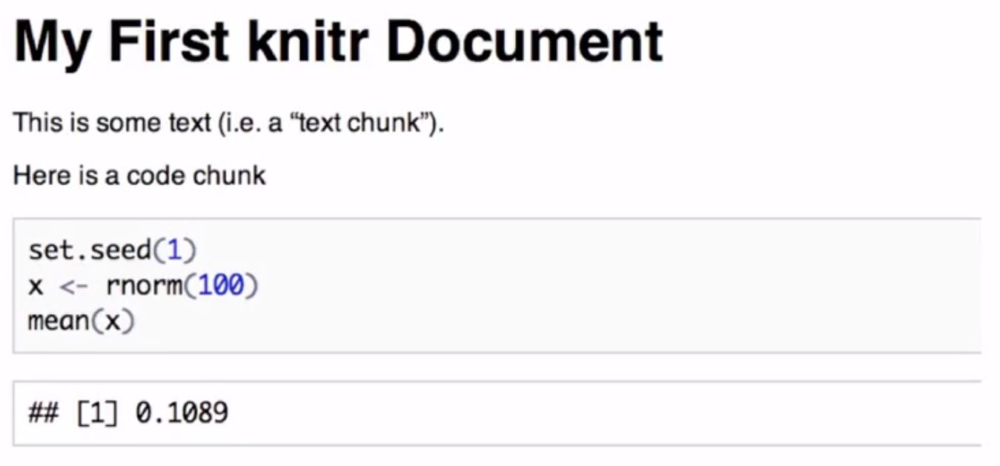

## What `knitr` produces: Markdown
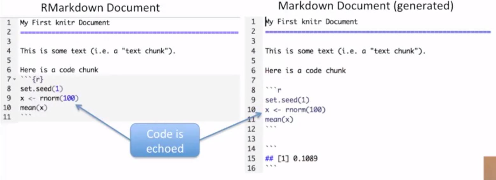

## A few notes
- `knitr` will fill a new document with filler text: delete it
- Code chunks begin with three backticks and {r} and end with three backticks
- Code chunks can have **names**, which is useful when we start making graphics. Just put them in the curly braces after `r`
- By default, code in a code chunk is echoed, as will the results of the computation (if there are results to print)

## Processing of `knitr` documents (what happens under the hood)
- You write the RMarkdown document (.Rmd)
- `knitr` produces a Markdown document (.md)
- `knitr` convers the Markdown document into HTML (by default)
- .Rmd -> .md -> .html
- You shoul NOT edit or save the .md or .html documents until you are finished

## Another Example
###### w/ echo = false for result only (no code echo)
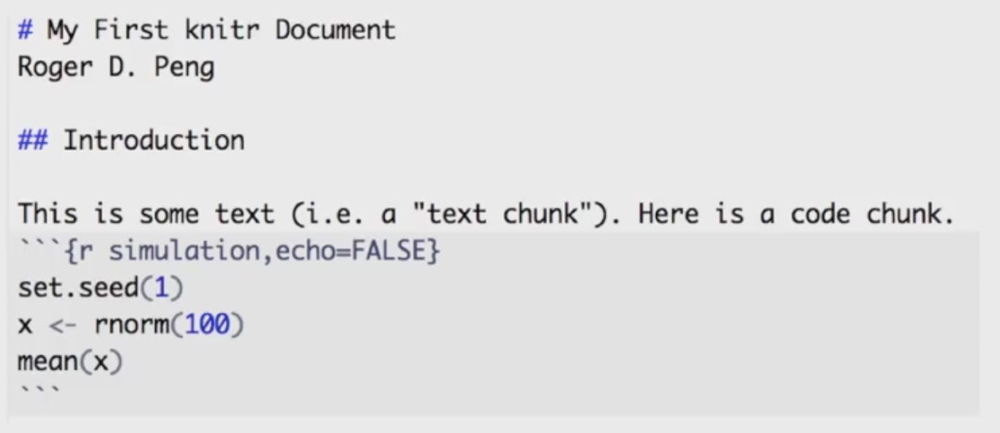
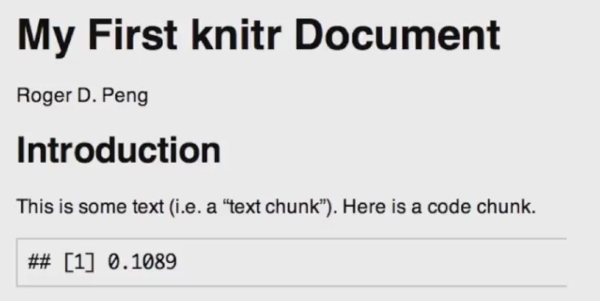

## Hiding results
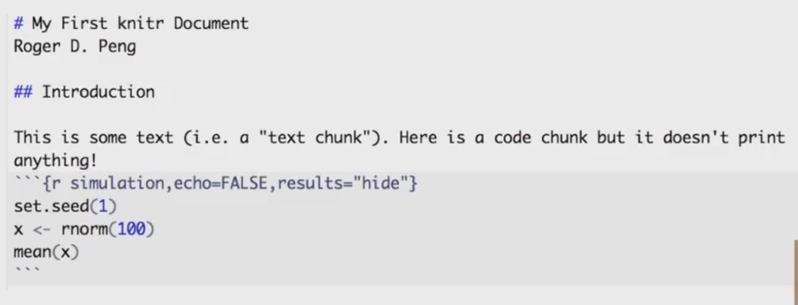
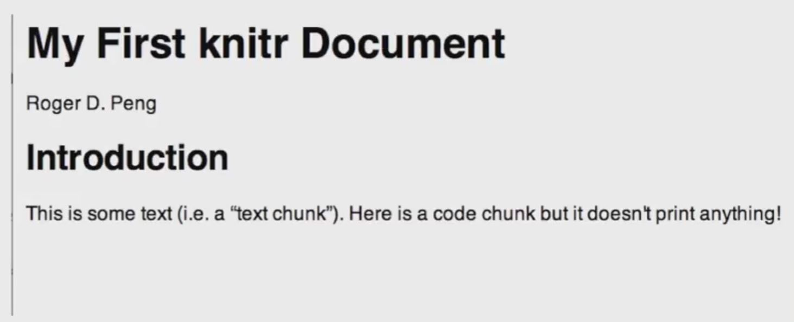

## Inline Text Computations
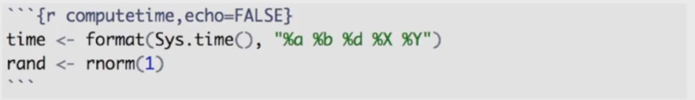

```{r computetime,echo=FALSE}
time <- format(Sys.time(), "%a %b %d %X %Y")
rand <- rnorm(1)
```

The current time is `r time`. My favorite random number is `r rand`.

## Incorporating Graphics
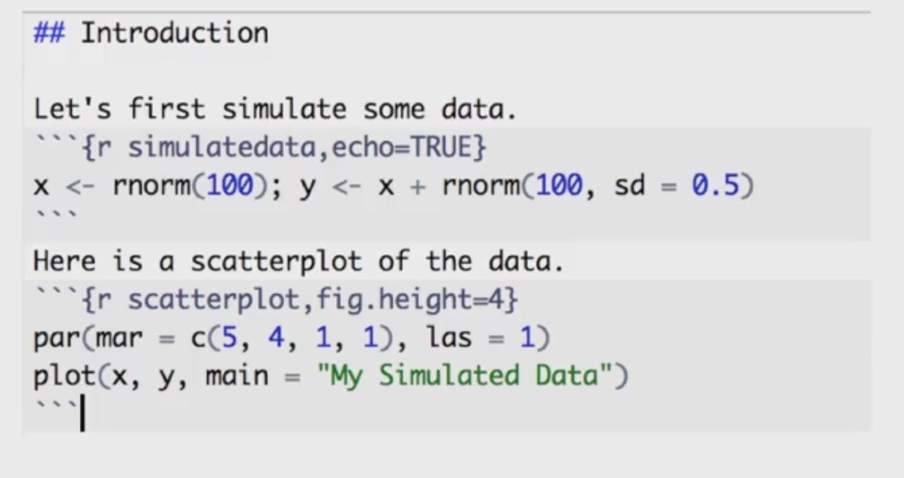

Let's first simulate some data.
```{r simulatedata,echo=TRUE}
x <- rnorm(100); y <- x + rnorm(100, sd=0.5)
```
Here is a scatterplot of the data
```{r scatterplot,fig.height=4}
par(mar=c(5, 4, 1, 1), las=1)
plot(x, y, main="My Simulated Data")
```

## What `knitr` produces in HTML
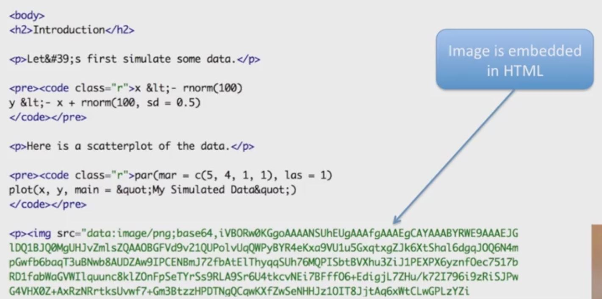

## Making Tables with `xtable`
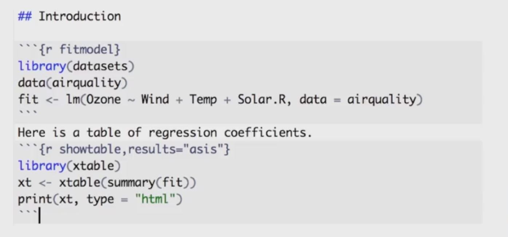
```{r fitmodel}
library(datasets)
data(airquality)
fit <- lm(Ozone ~ Wind + Temp + Solar.R, data=airquality)
```
Here is a table of regression coefficients
```{r showtable,results='asis'}
library(xtable)
xt <- xtable(summary(fit))
print(xt, type="html")
```

## Setting Global Options
- Sometimes we want to set options for **every** code chunk that are different from the defaults
- For example, we may want to suppress all code echoing and results output
- We have to write some code to set these global options

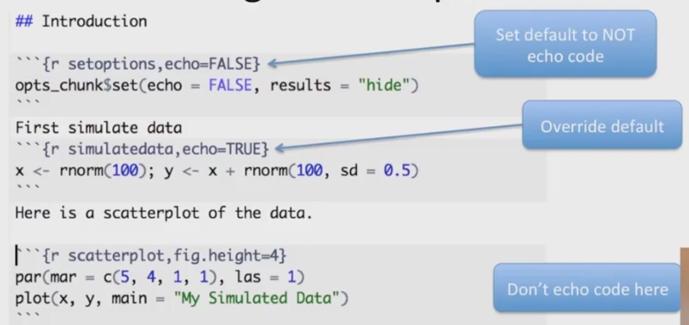

## Some Common Options
- Output
    - results: "asis", "hide"
    - echo: TRUE, FALSE
- Figures
    - fig.height: numeric
    - fig.width: numeric

## Caching Computations
- What if one chunk takes a long time to run?
- All chunks have to be re-computed every time you re-knit the file
- The `cache=TRUE` option can be set on a chunk-by-chunk basis to store results of computation
- After the first run, results are loaded from cache

## Caching Caveats
- If the data or the code (or anything external) changes, you need to re-run the cached code chunks
- Dependencies are not checked explicitly by `knitr`
- Chunks with significant _side effects_ may not be cacheable

## Summary
- Literate statistical programming can be a useful way to put text, code, data, & output all in one document
- `knitr` is a powerful tool for integrating code and text in a simple document format