# Evidence-based Data Analysis

## Replication and Reproducibility
##### Replication
- Focuses on the validity of the scientific claim
- "Is this claim true?"
- The ultimate standard for strengthening scientific evidence
- New investigators, data, analytical methods, laboratories, instruments, etc.
- Particularly important in studies that can impact broad policy or regulatory decisions

##### Reproducibility
- Focuses on the validity of the data analysis
- "Can we trust this analysis?"
- Arguably a minimum standard for any scientific study
- New investigators, same data, same methods
- Especially important when replication is impossible

## Background and Underlying Trends
- Some studies cannot be replicated: No time, no money, unique or opportunistic
- Technology is increasing data collection throughput; data are more complex and high-dimensional
- Existing databases can be merged to become bigger databases (but data are used off-label)
- Computing power allows more sophisticated analyses, even on "small" data
- For every field of study "X" there is a "Computational X"

## The Result?
- Even basic analyses are difficult to describe
- Heavy computational requirements are thrust upon people without adequate training in statistics and computing
- Errors are more easily introduced into long analysis pipelines
- Knowledge transfer is inhibited
- Results are difficult to replicate or reproduce
- Complicated analyses cannot be trusted

## What is Reproducible Research?
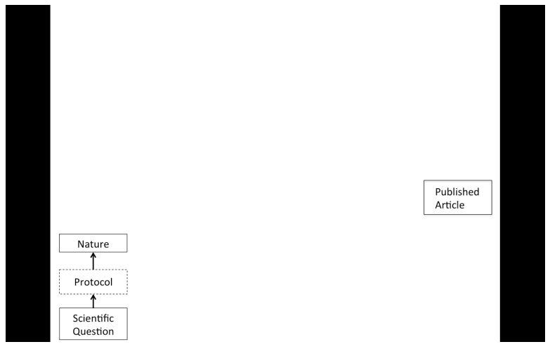

## What is Reproducible Research?
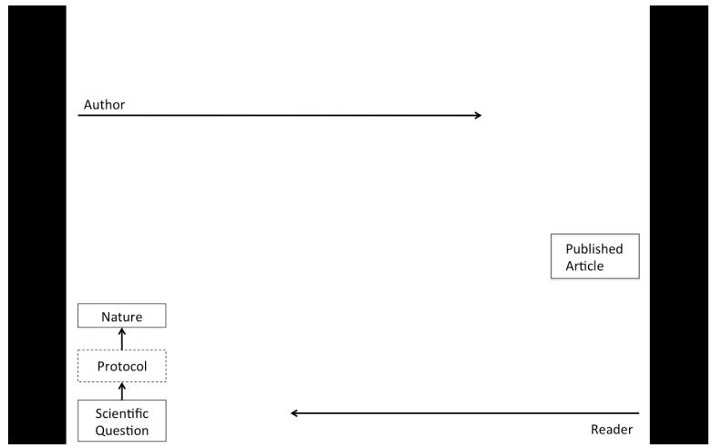

## What is Reproducible Research?
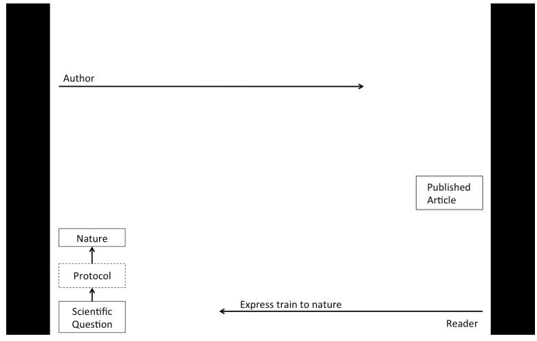

## What is Reproducible Research?
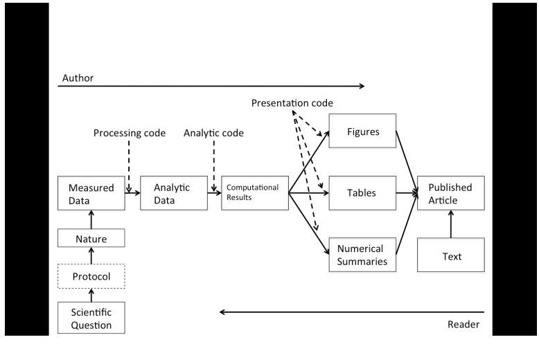

## What is Reproducible Research?
### Let's meet in the middle and make this stuff available
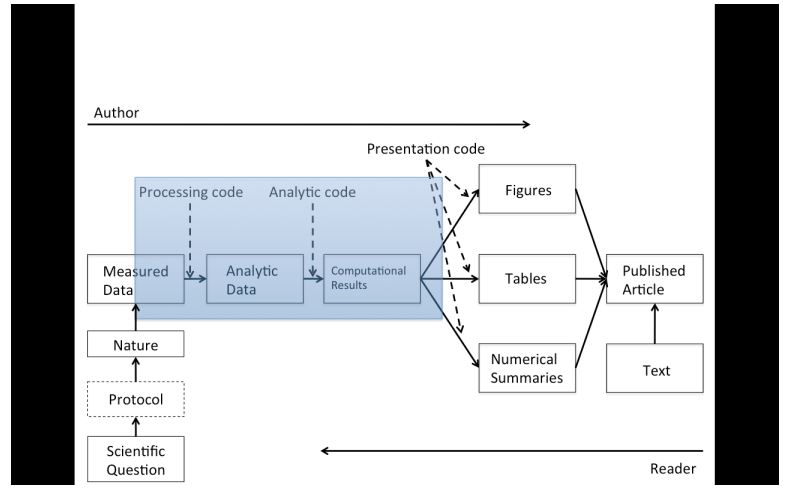

## What Problem Does Reproducibility Solve?
##### What we get
- Transparency
- Data availability
- Software availability
- Methods availability
- Improved transfer of knowledge

##### What we do NOT get
- Validity / correctness of the analysis

An analysis can be reproducible and still be wrong  

We want to know "can we trust this analysis?"  

Does requiring reproducibility deter bad analysis?  

## Problems with Reproducibility
##### The premise of reproducible research is that with data / code available, people can check each other and the whole system is self-correcting
- Addresses the most "downstream" aspect of the research process: post-publication
- Assumes everyone plays by the same rules and wants to achieve the same goals (i.e. scientific discovery)

## An Analogy from Asthma
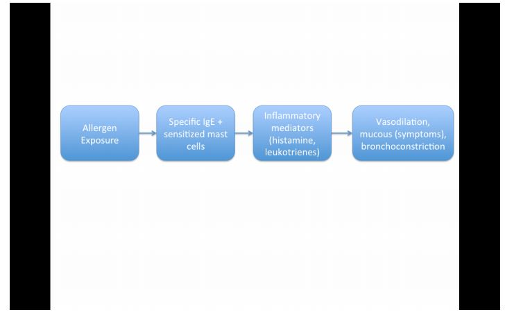

## An Analogy from Asthma
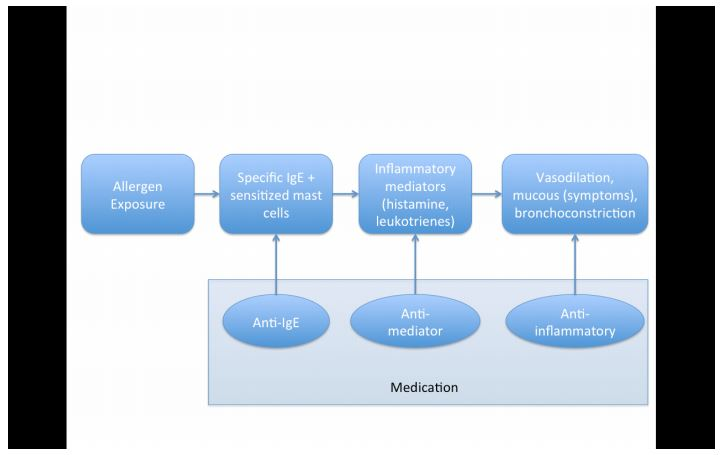

## An Analogy from Asthma
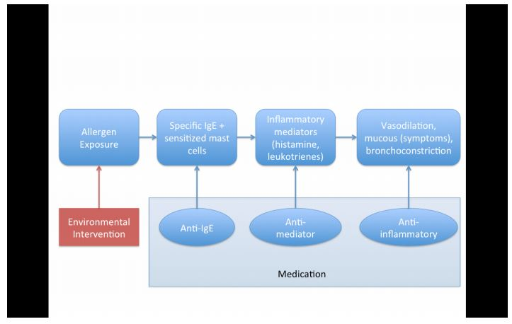

## Scientific Dissemination Process
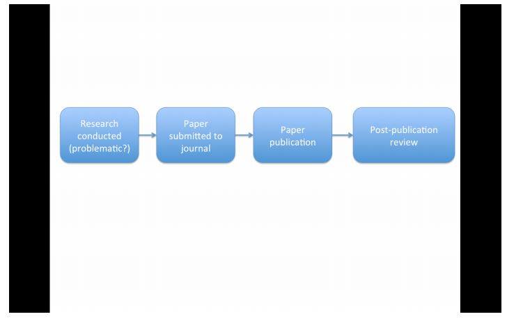

## Scientific Dissemination Process
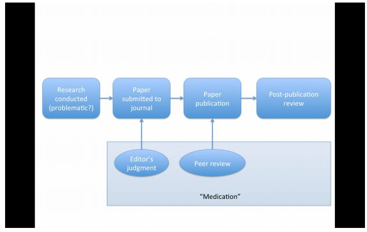

## Scientific Dissemination Process
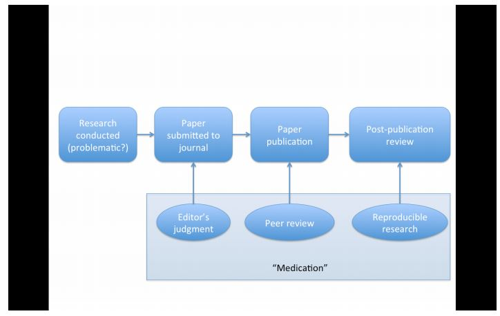

## Scientific Dissemination Process
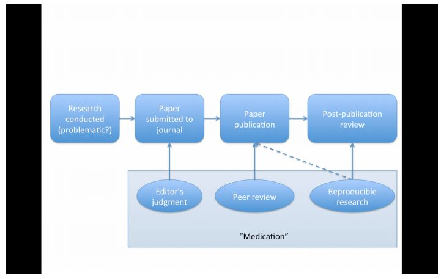

## Scientific Dissemination Process
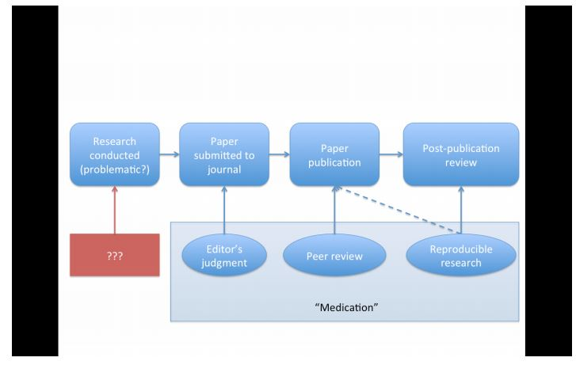

## At Biostatistics

## At Biostatistics
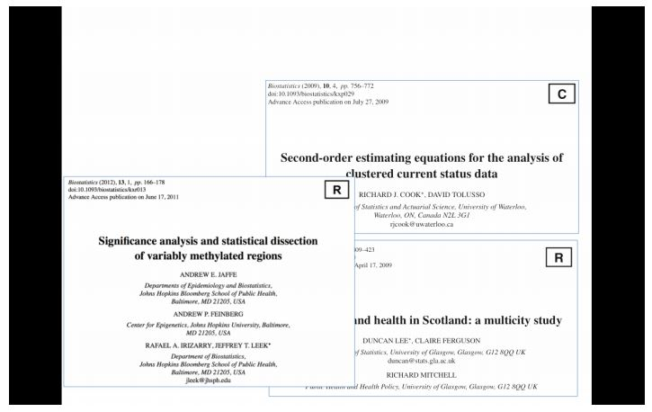

## Who Reproduces Research?
- For reproducibility to be effective as a means to check validity, someone needs to do something
    - Re-run the analysis, check results match
    - Check the code for bugs/errors
    - Try alternat approaches; check sensitivity
- The need for someone to do something is inherited from traditional notion of replication
- Who is "someone" and what are their goals?

## Who Reproduces Research?
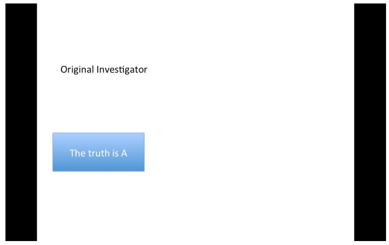

## Who Reproduces Research?
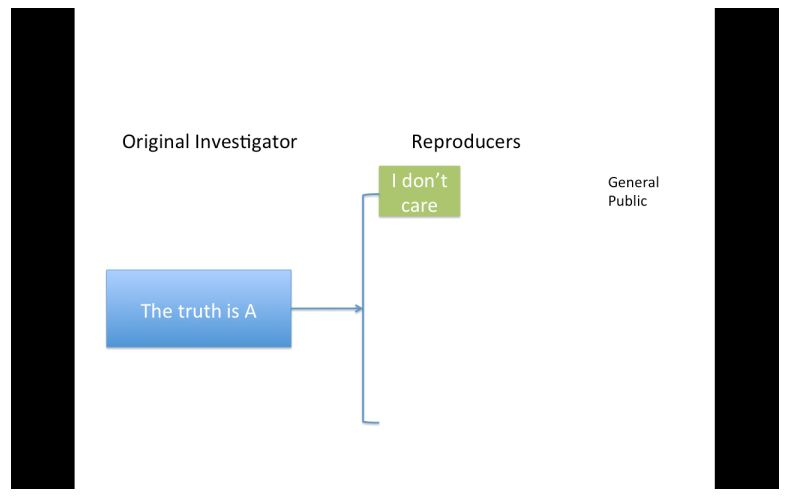

## Who Reproduces Research?
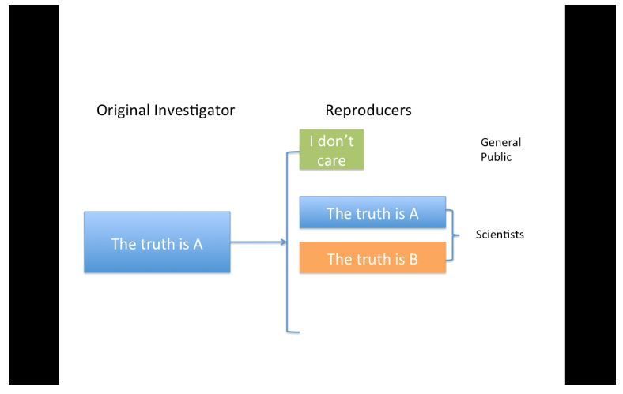

## Who Reproduces Research?
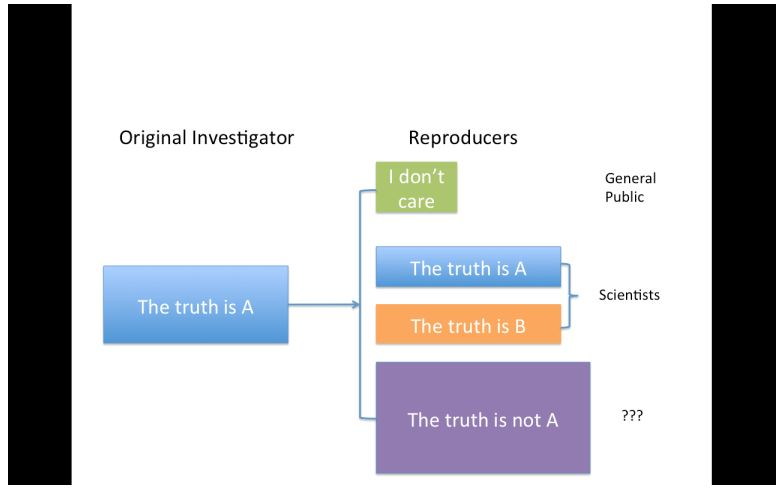

## The Story So Far
- Reproducibility brings transparency (wrt code + data) and increases transfer of knowledge
- A lot of discussion about how to get people to share data
- Key question of "Can we trust this analysis?" is not addressed by reproducibility
- Reproducibility addresses potential problems long after they've occurred ("downstream")
- Secondary analyses are inevitably colored by the interests and motivations of others

## Evidence-based Data Analysis
- Most data analyses involve stringing together many different tools and methods
- Some methods may be standard for a given field, but others are often applied ad hoc
- We should apply thoroughly studied (via statistical research), mutually agreed upon methods to analyze data whenever possible
- There should be evidence to justify the application of a given method

## Evidence-based Data Analysis
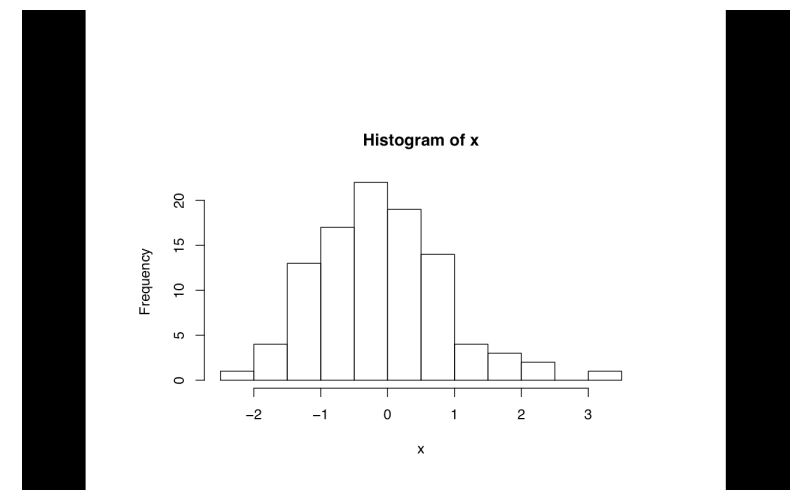

## Evidence-based Data Analysis
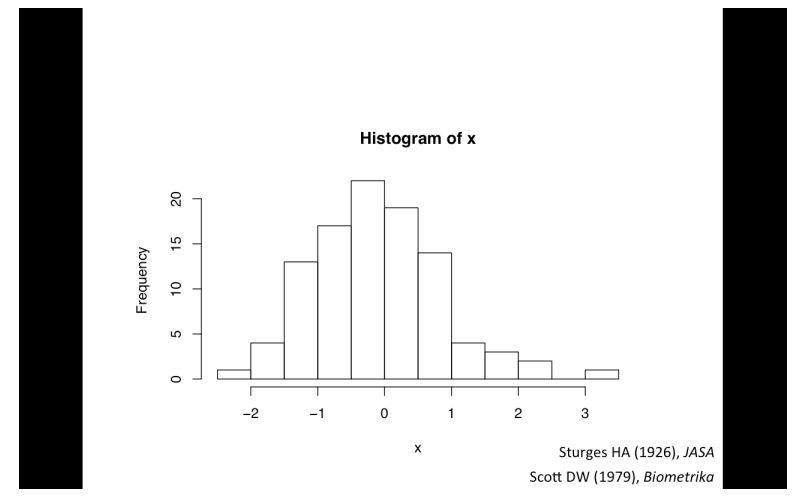

## Evidence-based Data Analysis
- Create analytic pipelines from evidence-based components -- standardize it
- A Deterministic Statistical Machine [http://goo.gl/Qvlhuv](http://goo.gl/Qvlhuv)
- Once an evidence-based analytic pipeline is established, we shouldn't mess with it
- Analysis with a "transparent box"
- Reduce the "researched degrees of freedom"
- Analogous to a pre-specified clinical trial protocol

## Deterministic Statistical Machine
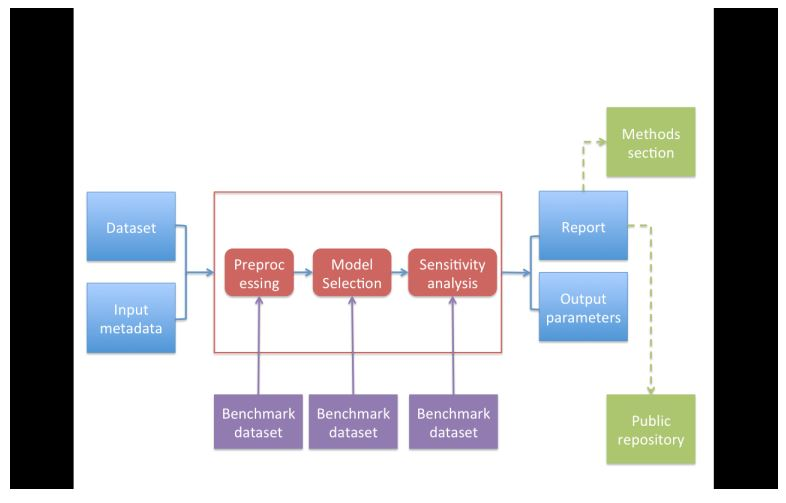

## Case Study: Estimating Acute Effects of Ambient Air Pollution Exposure
- Acute/short-term effects typically estimated via panel studies or time series studies
- Work originated in late 1970s/early 1980s
- Key question: "Are short-term changes in pollution associated with short-term changes in a population health outcome?"
- Studies usually conducted at a community level
- Long history of statistical research investigating proper methods of analysis

## Data from New York City
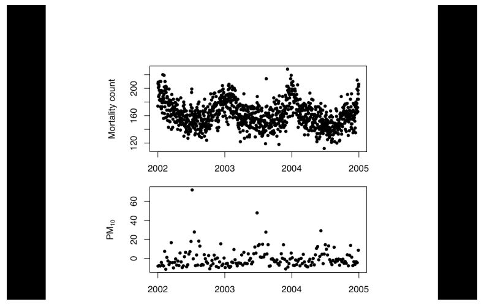

## Case Study: Estimating Acute Effects of Ambient Air Pollution Exposure
- Can we encode everything that we have found in statistical/epidemiological research into a single package?
- Time series studies do not have a huge range of variation; typically involves similar types of data and similar questions
- Can we create a deterministic statistical machine for this area?

## DSM Modules for Time Series Studies of Air Pollution and Health
1. Check for outliers, high leverage, overdispersion
2. Fill in missing data? NO!
3. Model selection: Estimate degrees of freedom to adjust for unmeasured confounders
    - Other aspects of model not as critical
4. Multiple lag analysis
5. Sensitivity analysis wrt
    - Unmeasured confounder adjustment
    - Influential points

## Where to Go From Here?
- One DSM is not enough, we need many!
- Different problems warrant different approaches and expertise
- A curated library of machines providing state-of-the-art analysis pipelines
- A CRAN/CPAN/CTAN... for data analysis
- Or a "Cochrane Collaboration" for data analysis

## A Model: Cochrane Collaboration
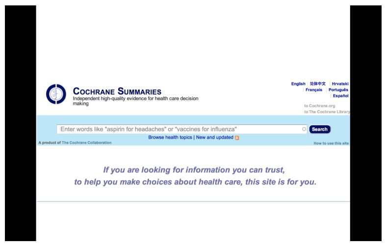

## A Model: Cochrane Collaboration
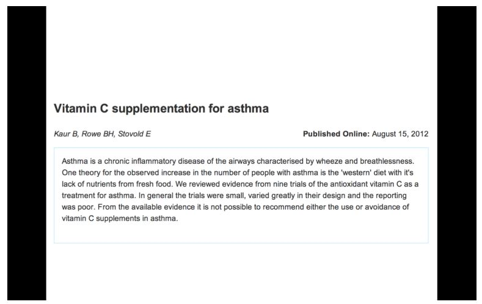

## A Model: Cochrane Collaboration
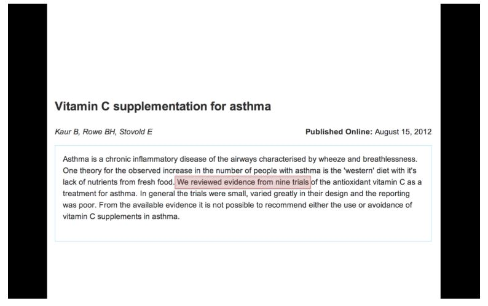

## A Model: Cochrane Collaboration
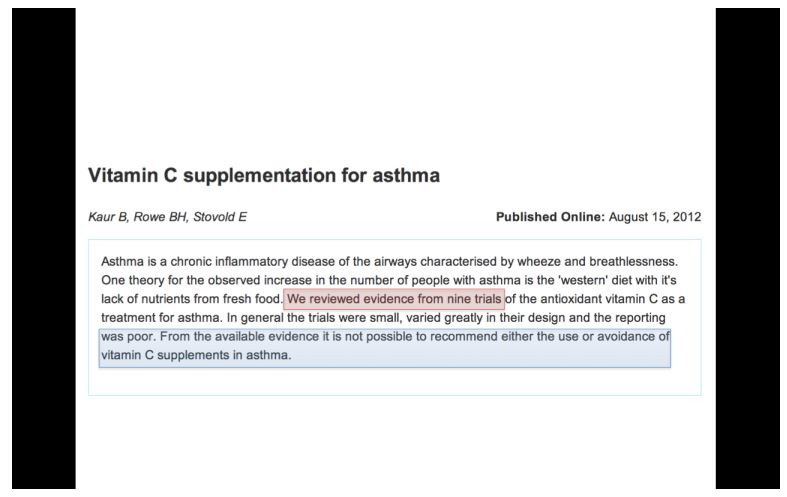

## A Curated Library of Data Analysis
- Provide packages that encode data analysis pipelines for given problems, technologies, questions
- Curated by experts knowledgeable in the field
- Documentation/references given supporting each module in the pipeline
- Changes introduced after passing relevant benchmarks/unit tests

## Summary
- Reproducible research is important, but does not necessarily solve the critical question of whether a data analysis is trustworthy
- Reproducible research focuses on the most "downstream" aspect of research dissemination
- Evidence-based data analysis would provide standardization, best practices for given scientific areas and questions
- Gives reviewers an important tool without dramatically increasing the burden on them
- More effort should be put into improving the quality of "upstream" aspects of scientific research
